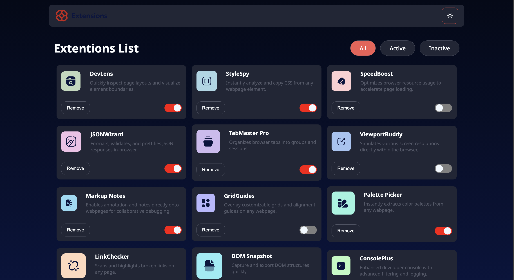
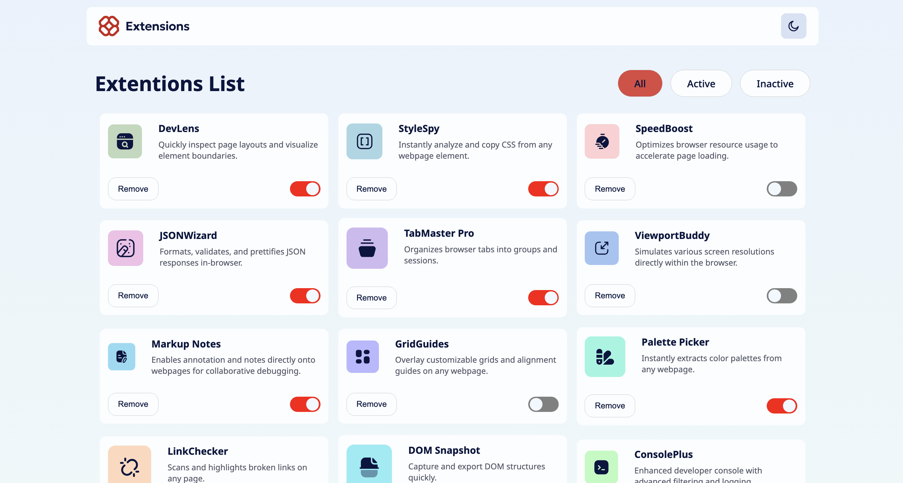
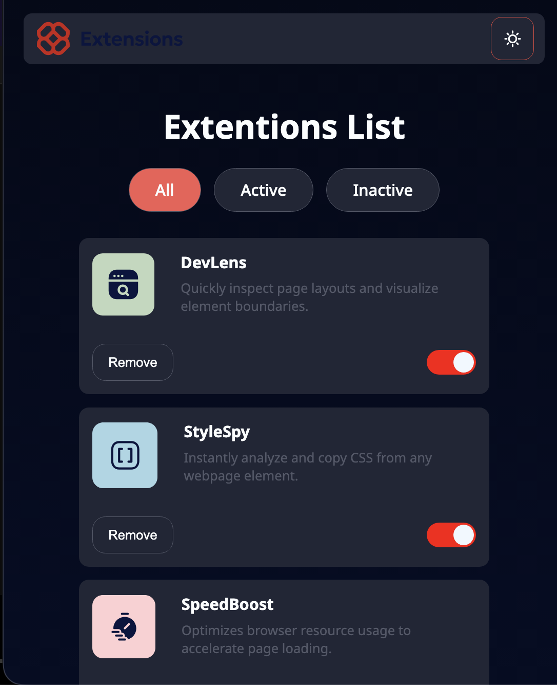

# Frontend Mentor - Browser extensions manager UI solution

This is a solution to the [Browser extensions manager UI challenge on Frontend Mentor](https://www.frontendmentor.io/challenges/browser-extension-manager-ui-yNZnOfsMAp).

## Table of contents

- [Frontend Mentor - Browser extensions manager UI solution](#frontend-mentor---browser-extensions-manager-ui-solution)
  - [Table of contents](#table-of-contents)
  - [Overview](#overview)
    - [The challenge](#the-challenge)
    - [Screenshot](#screenshot)
    - [Links](#links)
  - [My process](#my-process)
    - [Built with](#built-with)
    - [What I learned](#what-i-learned)
    - [Continued development](#continued-development)
  - [Author](#author)

## Overview

### The challenge

Users should be able to:

- Toggle extensions between active and inactive states ✅
- Filter active and inactive extensions ✅
- Remove extensions from the list ✅
- Select their color theme ✅
- View the optimal layout for the interface depending on their device's screen size ✅
- See hover and focus states for all interactive elements on the page ✅

### Screenshot

### Links

- Solution URL: [Add solution URL here](https://your-solution-url.com)
- Live Site URL: [Add live site URL here](https://your-live-site-url.com)

## My process

### Built with

- Semantic HTML5 markup
- CSS custom properties
- Flexbox
- CSS Grid
- Mobile-first workflow
- Typescript
- [React](https://reactjs.org/) - JS library
- [Styled Components](https://styled-components.com/) - For styles

### What I learned

- Custom **Toggle Swtich**
- Context API with useReducer.
- Persistence state managment using local storage

### Continued development

- I need more practice on responsive design using flexbox and Grid.
- I am looking forward to learn advance CSS - transitions and animatation
- I am still new to Typescript. Need to practice more.

## Author

<!-- - Website - [Add your name here](https://www.your-site.com) -->

- Frontend Mentor - [@prabhashranjaner](https://www.frontendmentor.io/profile/prabhashranjaner)
- X - [@prabhash\_\_dev](https://x.com/prabhash__dev)

**Note: Delete this note and add/remove/edit lines above based on what links you'd like to share.**
